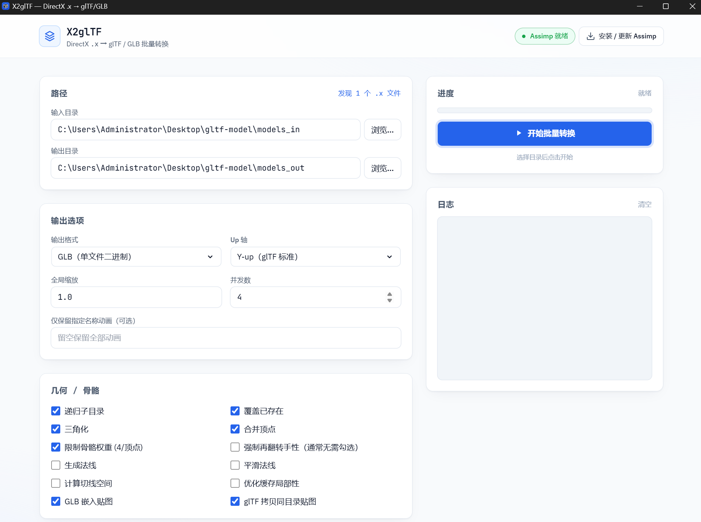
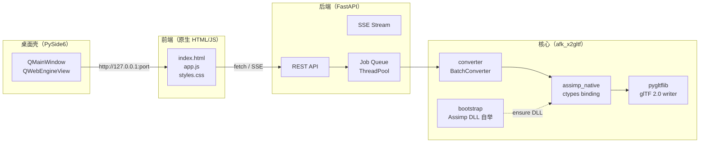

<div align="center">


# X2glTF

**DirectX `.x` → glTF / GLB 批量转换器**

一个自带 Assimp 自举、桌面 GUI、命令行与 HTTP 服务三合一的现代化 3D 模型管线工具。

[](https://www.python.org/)
[](https://fastapi.tiangolo.com/)
[](https://doc.qt.io/qtforpython-6/)
[](https://github.com/assimp/assimp)
[](https://www.khronos.org/gltf/)
[]()
[](#-许可)



</div>

---

## 目录

- [亮点一览](#-亮点一览)
- [预览与能力](#-预览与能力)
- [快速开始](#-快速开始)
- [使用方式](#-使用方式)
  - [桌面 GUI](#桌面-gui)
  - [命令行 CLI](#命令行-cli)
  - [HTTP / REST 服务](#http--rest-服务)
- [参数速查表](#-参数速查表)
- [架构概览](#-架构概览)
- [目录结构](#-目录结构)
- [Assimp 自动 Bootstrap](#-assimp-自动-bootstrap)
- [常见问题](#-常见问题)
- [开发](#-开发)
- [致谢](#-致谢)
- [许可](#-许可)

---

## 亮点一览

<table>
<tr>
<td width="33%" valign="top">

### 零配置自举
首次运行自动从 GitHub Release 下载并注册 Assimp 原生 DLL，**无需手动安装 VC++/Assimp**。

</td>
<td width="33%" valign="top">

### 三种形态
- 现代化桌面 GUI（Qt WebEngine + 原生系统对话框）
- 脚本友好的 CLI
- 可嵌入的 FastAPI REST + SSE 实时进度

</td>
<td width="33%" valign="top">

### 管线级转换
坐标轴翻转、手性修正、切线空间、法线重算、骨骼权重裁剪、动画过滤、贴图嵌入/拷贝全都内置。

</td>
</tr>
<tr>
<td valign="top">

### 多线程批量
`ThreadPoolExecutor` 并发 + 递归扫描 + 已存在文件跳过 / 覆盖策略。

</td>
<td valign="top">

### 标准 glTF 2.0 输出
基于 `pygltflib`，输出 **`.glb` 单文件**或**`.gltf` + 同目录贴图**，即刻用于 Three.js / Babylon.js / Blender / UE / Unity。

</td>
<td valign="top">

### 可复现
产物目录生成 `_convert_report.json` 转换报告，含每个源文件的状态、警告与目标路径。

</td>
</tr>
</table>

---

## 预览与能力

| 能力                     | 说明                                                                 |
| ------------------------ | -------------------------------------------------------------------- |
| **输入格式**             | DirectX Retained Mode `.x`（文本 / 二进制）                          |
| **输出格式**             | `glb`（单文件二进制） / `gltf`（JSON + BIN + 贴图目录）              |
| **几何**                 | 三角化、顶点合并、法线生成（平面/平滑）、切线空间计算、缓存优化      |
| **骨骼**                 | 4 权重/顶点裁剪、保留 skin joints 完整树                             |
| **动画**                 | 全部保留，或通过 `--keep-anim` 仅保留指定名称                        |
| **坐标系**               | Y-up / Z-up / 原样；可选再翻转手性                                   |
| **贴图**                 | GLB 嵌入；glTF 同目录拷贝                                            |
| **并发**                 | 线程池，默认 4 workers                                               |
| **报告**                 | `_convert_report.json`                                               |

---

## 快速开始

### 环境要求

- Windows 10/11 x64
- Python **3.11+**
- 联网（**仅首次**，用于拉取 Assimp Release）

### 安装

```powershell
git clone https://github.com/<your-org>/X2glTF.git
cd X2glTF

python -m venv .venv
.\.venv\Scripts\Activate.ps1

pip install -r requirements.txt
```

### 一键启动（桌面 GUI）

```powershell
python main.py
```

首次启动会在后台自动完成：

1. 拉起内嵌 FastAPI 服务（随机端口）
2. 若未检测到 Assimp DLL，自动下载并注册到 `vendor/assimp/`
3. 打开 Qt WebEngine 窗口加载前端

---

## 使用方式

### 桌面 GUI

将 `.x` 文件放入 `models_in/`（或 GUI 中选择任意目录），配置后点击 **开始批量转换**：

<div align="center">
  
</div>

GUI 会通过 SSE 流式推送每个文件的转换状态到日志面板。

### 命令行 CLI

最简单的用法：

```powershell
python main.py --cli
```

完整示例：

```powershell
python main.py --cli `
  -i .\models_in `
  -o .\models_out `
  -f glb `
  --axis y_up `
  --workers 8 `
  --keep-anim "Idle"
```

只安装 / 重装 Assimp（不启动界面）：

```powershell
python main.py --install-assimp
python main.py --reinstall-assimp
```

仅启动 HTTP 服务（无窗口，供脚本/容器使用）：

```powershell
python main.py --serve --host 0.0.0.0 --port 8765
```

### HTTP / REST 服务

服务启动后暴露以下端点：

| 方法   | 路径                              | 作用                                        |
| ------ | --------------------------------- | ------------------------------------------- |
| `GET`  | `/api/health`                     | 健康检查 & Assimp 是否就绪                  |
| `GET`  | `/api/defaults`                   | 默认输入/输出目录                           |
| `POST` | `/api/pick-folder`                | 弹出系统原生选择文件夹对话框                |
| `GET`  | `/api/scan?dir=...&recursive=...` | 扫描目录中的 `.x` 文件                      |
| `POST` | `/api/convert`                    | 提交转换任务，返回 `job_id`                 |
| `GET`  | `/api/convert/{job_id}/stream`    | **SSE** 实时流式进度                        |
| `POST` | `/api/assimp/install?force=bool`  | 触发 Assimp 安装                            |
| `GET`  | `/api/assimp/status`              | Assimp 安装状态                             |

示例：

```bash
curl -X POST http://127.0.0.1:8765/api/convert \
  -H "Content-Type: application/json" \
  -d '{
    "input_dir":  "C:/models_in",
    "output_dir": "C:/models_out",
    "output_format": "glb",
    "recursive": true,
    "axis_up": "y_up",
    "workers": 8
  }'
```

---

## 参数速查表

### CLI 参数

| 参数                         | 类型       | 默认    | 说明                                          |
| ---------------------------- | ---------- | ------- | --------------------------------------------- |
| `-i, --input`                | Path       | `models_in`  | 输入目录                                 |
| `-o, --output`               | Path       | `models_out` | 输出目录                                 |
| `-f, --format`               | `glb\|gltf`| `glb`   | 输出格式                                      |
| `--no-recursive`             | flag       | -       | 关闭递归扫描子目录                            |
| `--no-overwrite`             | flag       | -       | 目标存在则跳过                                |
| `--workers`                  | int        | `4`     | 并发线程数                                    |
| `--axis`                     | `y_up\|z_up\|keep` | `y_up` | 输出 Up 轴                            |
| `--flip-handedness`          | flag       | -       | 再翻转手性（通常无需）                        |
| `--scale`                    | float      | `1.0`   | 全局缩放                                      |
| `--gen-normals`              | flag       | -       | 生成法线                                      |
| `--gen-smooth-normals`       | flag       | -       | 生成平滑法线                                  |
| `--calc-tangent`             | flag       | -       | 计算切线空间                                  |
| `--no-triangulate`           | flag       | -       | 禁用三角化                                    |
| `--no-join-vertices`         | flag       | -       | 禁用顶点合并                                  |
| `--no-limit-bone-weights`    | flag       | -       | 不限制骨骼权重数量（默认 4/顶点）             |
| `--keep-anim NAME`           | string     | `""`    | 仅保留指定名称动画                            |
| `--serve`                    | flag       | -       | 仅起服务，不开窗口                            |
| `--cli`                      | flag       | -       | 命令行模式                                    |
| `--install-assimp`           | flag       | -       | 安装 Assimp 后退出                            |
| `--reinstall-assimp`         | flag       | -       | 强制重装 Assimp                               |

### `ConvertConfig`（代码调用）

```python
from afk_x2gltf import BatchConverter, ConvertConfig, OutputFormat, AxisUp
from pathlib import Path

cfg = ConvertConfig(
    input_dir  = Path("models_in"),
    output_dir = Path("models_out"),
    output_format = OutputFormat.GLB,
    axis_up = AxisUp.Y_UP,
    workers = 8,
    keep_single_animation = "Idle",
)

results = BatchConverter(cfg).run(
    progress=lambda d, t, src, msg: print(f"[{d}/{t}] {src}: {msg}")
)
```

---

## 架构概览



启动时序：

```
main.py
 └─► _start_server()   # 后台线程起 FastAPI，获取真实端口
 └─► _ensure_assimp_quietly()
 └─► _launch_desktop() # Qt 窗口加载 http://127.0.0.1:<port>
```

---

## 目录结构

```text
X2glTF/
├── main.py                     # 入口：GUI / CLI / Serve 分发
├── requirements.txt
├── afk_x2gltf/                 # 核心包
│   ├── __init__.py
│   ├── bootstrap.py            # Assimp 下载 / 注册 DLL / distutils shim
│   ├── assimp_native.py        # ctypes 加载 assimp-vcXXX-mt.dll
│   ├── converter.py            # BatchConverter + ConvertResult
│   ├── config.py               # ConvertConfig / OutputFormat / AxisUp
│   └── native_dialog.py        # 系统原生"选择文件夹"
├── backend/
│   └── server.py               # FastAPI 应用 + SSE 进度流
├── frontend/
│   ├── index.html              # 主 UI
│   ├── app.js
│   └── styles.css
├── assets/                     # 应用图标
├── vendor/assimp/              # 自举下载的 Assimp DLL（gitignored）
├── models_in/                  # 默认输入目录
└── models_out/                 # 默认输出目录 + _convert_report.json
```

---

## Assimp 自动 Bootstrap

首次启动时 `afk_x2gltf.bootstrap.ensure_assimp()` 会：

1. 检查 `vendor/assimp/assimp*.dll` 是否已存在；
2. 若无，则从 GitHub Release 拉取 **Assimp `v6.0.2`** 的 Windows 预编译包；
3. 解压出 `assimp-vcXXX-mt.dll`、`draco.dll`、VC Runtime 等必要 DLL；
4. 通过 `os.add_dll_directory()` + `pyassimp.helper.additional_dirs` 双重注册搜索路径；
5. 写入 `.installed.json` 作为安装标记。

> 代理环境下的下载失败会清晰报错，可手动将 DLL 放入 `vendor/assimp/` 跳过网络步骤。

---

## 常见问题

<details>
<summary><b>启动后窗口白屏 / 卡住？</b></summary>

Qt WebEngine 依赖 VC Runtime，请确保已安装 **Microsoft Visual C++ 2015–2022 Redistributable (x64)**；同时检查防火墙是否放行本机随机端口。

</details>

<details>
<summary><b>提示 "assimp DLL not found"？</b></summary>

手动触发安装：

```powershell
python main.py --install-assimp
```

或从 [Assimp Releases](https://github.com/assimp/assimp/releases) 下载 `windows-x64-v6.0.2.zip`，解压出 `assimp-vc143-mt.dll` 放到 `vendor/assimp/`。

</details>

<details>
<summary><b>动画方向 / 坐标系看起来不对？</b></summary>

DirectX `.x` 默认 **Left-Handed + Z-up**。Assimp 的 `.x` 导入器已做一次手性翻转，一般只需选择 Y-up 输出；如果仍然"穿模 / 反向"，可加 `--flip-handedness` 试试。

</details>

<details>
<summary><b>如何做成单独的 .exe？</b></summary>

推荐 PyInstaller：

```powershell
pip install pyinstaller
pyinstaller -w -F -n X2glTF `
  --icon assets\icon.ico `
  --add-data "frontend;frontend" `
  --add-data "assets;assets" `
  main.py
```

打包后的 `.exe` 仍会在首次运行时自举 Assimp。

</details>

---

## 开发

```powershell
python -m venv .venv
.\.venv\Scripts\Activate.ps1
pip install -r requirements.txt

python main.py --serve --port 8765
```

然后直接用浏览器打开 <http://127.0.0.1:8765/> 开发前端，代码位于 `frontend/`。

后端热更新：

```powershell
uvicorn backend.server:app --reload --port 8765
```

---

## 致谢

- [assimp/assimp](https://github.com/assimp/assimp) — Open Asset Import Library
- [KhronosGroup/glTF](https://github.com/KhronosGroup/glTF) — glTF 2.0 规范
- [dadoum/pygltflib](https://gitlab.com/dodgyville/pygltflib)
- [FastAPI](https://fastapi.tiangolo.com/) · [PySide6](https://doc.qt.io/qtforpython-6/)

---

## 许可

MIT License — 详见 [`LICENSE`](./LICENSE)。

> 注：项目自举下载的 Assimp 二进制遵循其自身的 [BSD-3-Clause](https://github.com/assimp/assimp/blob/master/LICENSE) 许可。

<div align="center">

<sub>Built with care for DirectX legacy asset pipelines.</sub>

</div>
